# Follow API + GUI

Expose une `Repository` Follow existante en REST (FastAPI), avec une application web
multipage servie par le même processus pour créer/consulter/conclure des expériences sans
passer par le CLI.

## Démarrer / arrêter

```bash
pip install "follow[api]"

follow_api start --repo .follow --port 8000
#   Accueil        : http://127.0.0.1:8000/
#   Application    : http://127.0.0.1:8000/app
#   Documentation  : http://127.0.0.1:8000/docs

follow_api status
follow_api stop
```

Un seul serveur est suivi à la fois (pidfile + métadonnées sous `~/.follow/api/`) : `start`
échoue si un serveur tourne déjà, `stop`/`status` n'ont besoin d'aucun argument.

Un type de `Structure` déjà utilisé par une expérience du dépôt est importé automatiquement au
démarrage. Pour qu'un type **encore jamais committé** apparaisse dans le formulaire "nouvelle
expérience", listez son module avec `--structures` :

```bash
follow_api start --repo .follow --structures examples.recipe --structures examples.wafer_doe
```

## Navigation

L'application (`/app`) est une single-page app **routée** : chaque écran a sa propre URL sous
`/app/...`, gérée côté client par l'historique du navigateur (`history.pushState`, voir le
routeur en tête de `static/app.js`). Le serveur sert la même page (`static/index.html`) pour
`/app` et pour tout `/app/<chemin>` (`app_shell` dans `app.py`) ; c'est le JS qui lit
`location.pathname` au chargement et affiche l'écran correspondant. Conséquence : un lien direct,
un rafraîchissement de page (F5) ou les boutons précédent/suivant du navigateur amènent toujours
au bon écran, comme sur un site classique — ce n'est pas juste un panneau qui change de contenu
sans que l'URL ne bouge.

La barre `#topnav` (en haut) et la sidebar (branches/tags/recherche d'entité, à gauche) sont
communes à tous les écrans ; seule la zone `#view` change d'un écran à l'autre.

| Route                       | Écran                                                    |
|------------------------------|-----------------------------------------------------------|
| `/app`                       | Tableau de bord (compteurs, raccourcis)                   |
| `/app/en-cours`               | Expériences en cours (toutes branches), paginé             |
| `/app/terminees`              | Expériences terminées (toutes branches), paginé            |
| `/app/historique/<ref>`       | Historique d'une branche/tag (lignée en premier parent), paginé |
| `/app/experience/<id>`        | Fiche d'une expérience (+ diff vs référence si elle en a une) |
| `/app/nouvelle`                | Formulaire "nouvelle expérience"                            |
| `/app/deriver/<id>`            | Formulaire "dériver" (structure, preuves, conclusion)       |
| `/app/fusionner`               | Formulaire de fusion (`git merge`)                          |
| `/app/refs`                    | Créer/déplacer une branche ou un tag                        |
| `/app/entite/<entity_id>`      | Trace d'une entité physique, toutes branches confondues     |
| `/app/graphe`                  | Graphe de filiation (Plotly, en iframe)                     |
| `/app/exemples`                | Galerie des rapports de démonstration                       |

## Pages (captures)

### Accueil (`/`)

Page d'accueil sobre : tagline, points clés, liens vers l'app/la doc/les exemples/GitHub.

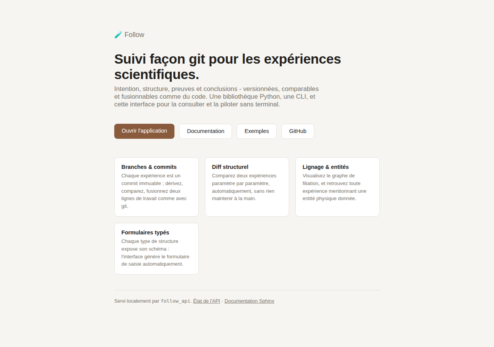

### Tableau de bord (`/app`)

Appelle `GET /api/health` (qui compte les expériences en cours/terminées/branches en plus de
l'état de santé) et `GET /api/branches` pour la sidebar. Les tuiles renvoient vers les écrans
correspondants.

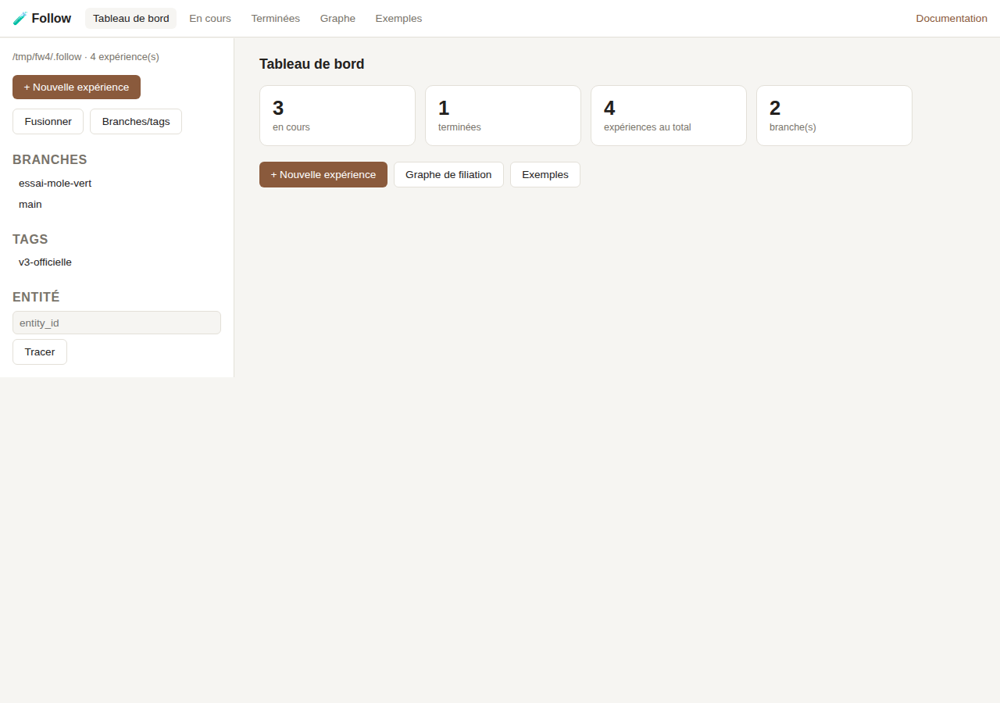

### En cours / Terminées (`/app/en-cours`, `/app/terminees`)

`GET /api/experiments?status=running|completed&offset=&limit=` — toutes les expériences du
dépôt (pas seulement la lignée d'une branche), filtrées sur `conclusion.status`
(`draft`/`running` = en cours, `concluded`/`abandoned` = terminée) et paginées.

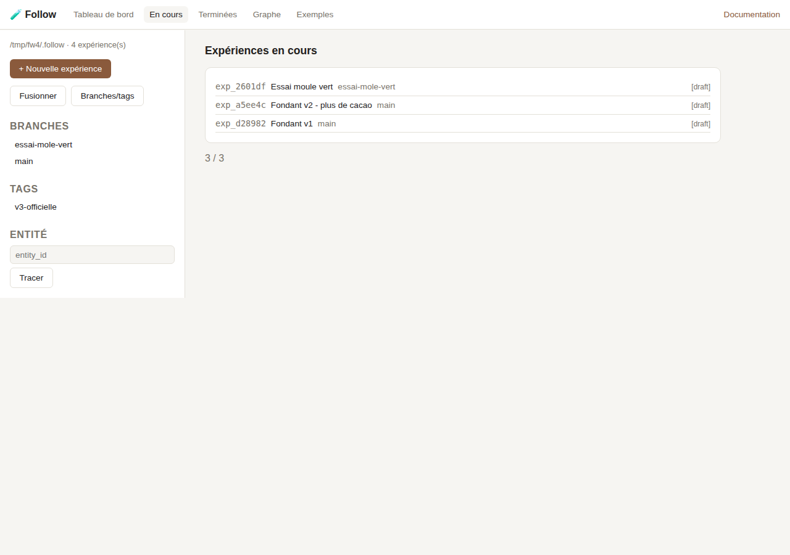
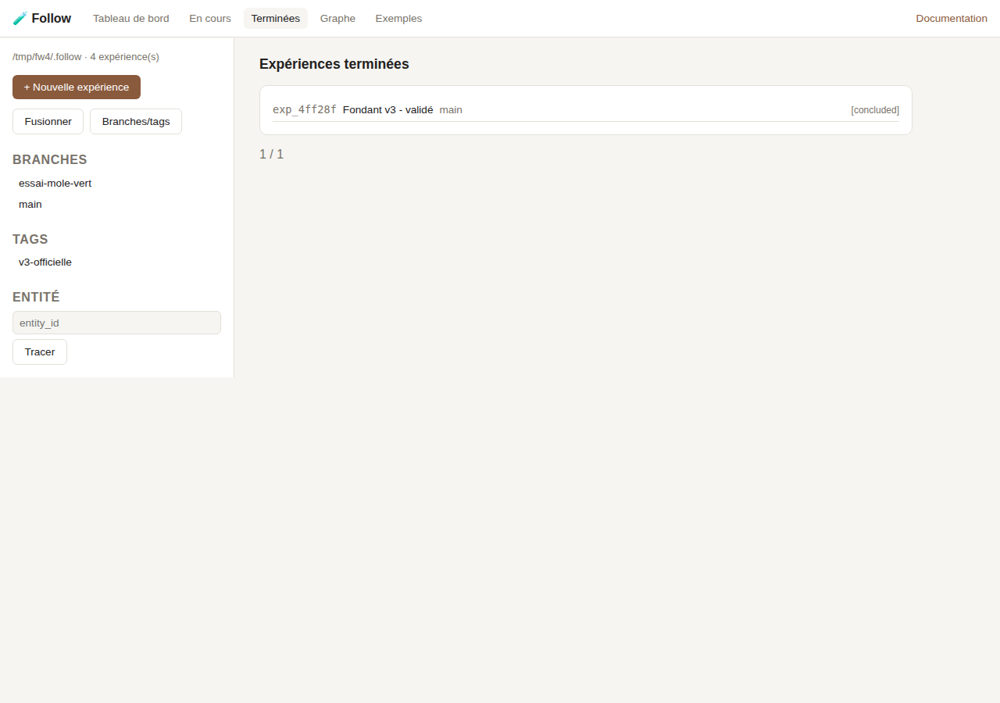

### Fiche d'une expérience (`/app/experience/<id>`)

`GET /api/experiments/{ref}` renvoie l'expérience et sa fiche déjà rendue en Markdown
(`fiche_markdown`, produite par `follow.rendering.render_fiche` — la même fonction que la CLI).
Si l'expérience a une référence `baseline`, un second appel à `GET /api/diff?a=&b=` affiche le
diff structurel juste au-dessus.

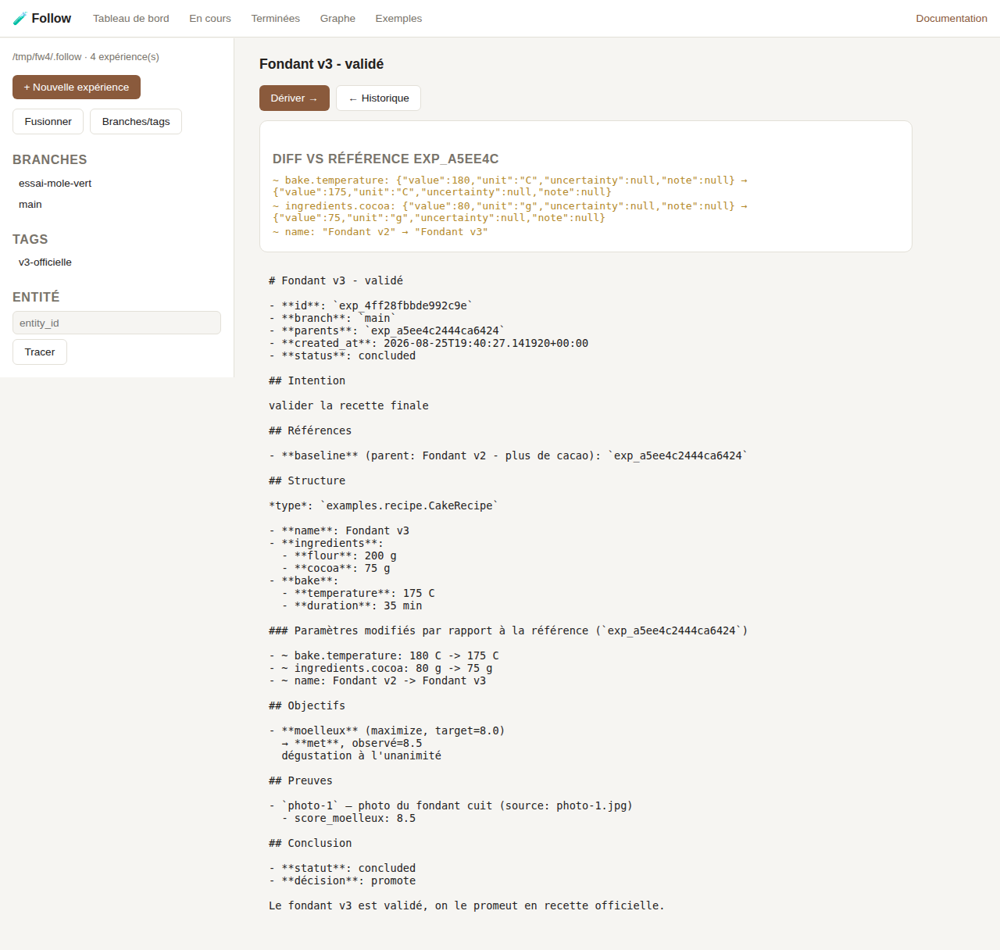

### Graphe de filiation (`/app/graphe`)

Une `<iframe>` pointant sur `GET /api/graph.html`, qui renvoie une page Plotly autonome (même
figure que `follow graph` écrit sur disque, via `follow.graphing.build_graph_figure`).

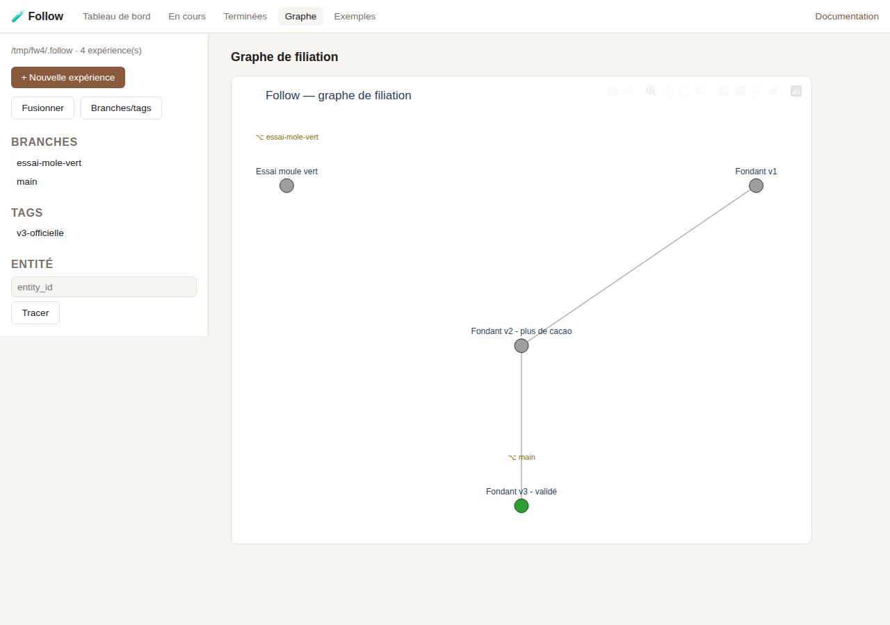

### Nouvelle expérience (`/app/nouvelle`)

`GET /api/structures` liste les types de `Structure` enregistrés ; en choisir un déclenche
`GET /api/structures/{key}/schema` (JSON Schema Pydantic), à partir duquel le formulaire de
structure est généré récursivement (objets, tableaux, `dict[str, X]`, enums...). `GET
/api/commit_form` ajoute les champs du formulaire de commit du dépôt s'il y en a un. La
soumission fait un seul `POST /api/experiments` (création + commit en un temps, pas d'étape
brouillon côté API).

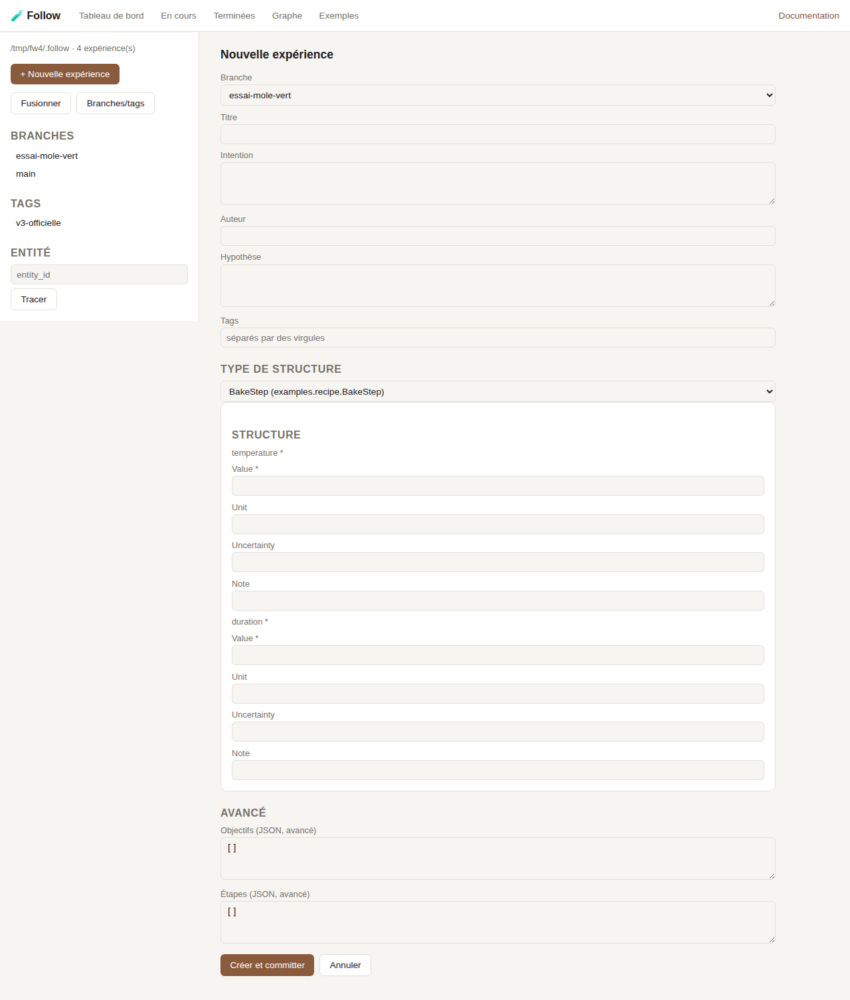

### Dériver + conclure (`/app/deriver/<id>`)

Même générateur de formulaire que ci-dessus, préchargé avec la structure du parent. S'y ajoutent
un éditeur de preuves et un éditeur de conclusion (statut, décision, résumé, verdict par
objectif) — c'est l'écran qui permet de réellement **clôturer** une expérience, pas seulement
d'en créer. `POST /api/experiments/{ref}/derive`.

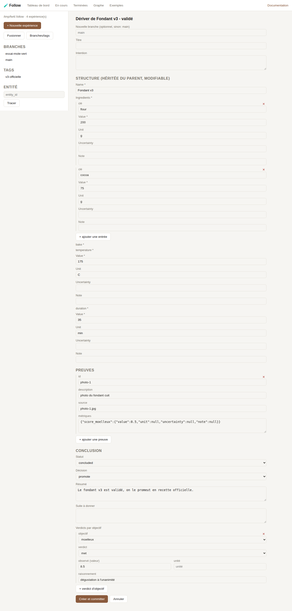

### Fusionner (`/app/fusionner`)

`POST /api/merge` : deux refs, les chemins à prendre de B (`take_structure`/`take_steps`, au
format renvoyé par `GET /api/diff`), la branche cible.

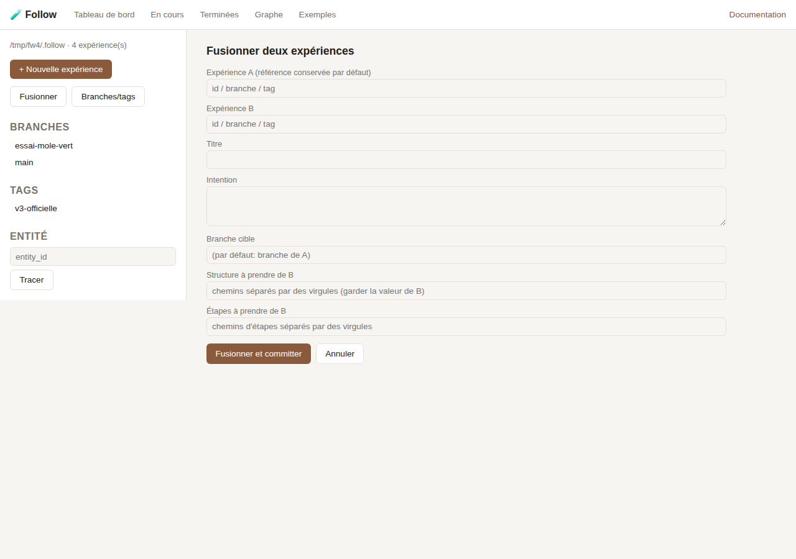

### Branches & tags (`/app/refs`)

`POST /api/branches` / `POST /api/tags` (avec `force` pour déplacer un pointeur existant).

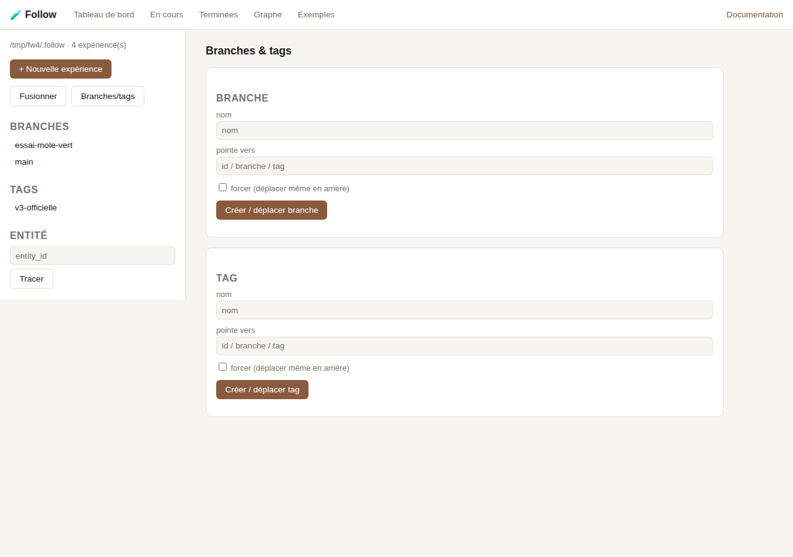

### Exemples (`/app/exemples`)

`GET /api/examples` liste les rapports de démonstration présents sous `demos/output/` (titre +
description, voir `EXAMPLES_MANIFEST` dans `app.py`) ; chaque carte ouvre le rapport HTML
autonome correspondant, servi statiquement sous `/examples-gallery/<fichier>`.

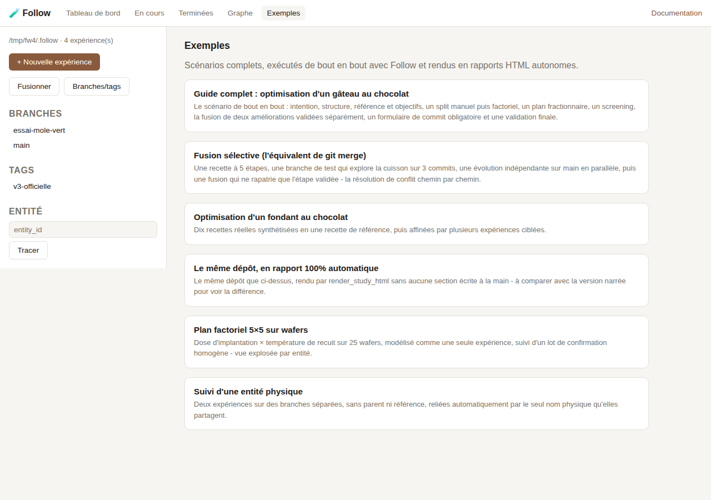

### Documentation (`/docs`)

Le site Sphinx du projet (`docs/`), servi tel quel s'il a été construit
(`sphinx-build -b html docs docs/_build/html`, ou `follow_api start --build-docs`) ; sinon une
page explique comment le construire. Note technique : FastAPI réserve `/docs` par défaut pour sa
propre UI Swagger — elle est désactivée (`docs_url=None` dans `create_app`) pour laisser cette
route à la vraie documentation.

## Référence API

Toutes les routes sont sous `/api`, en JSON.

| Route | Description |
|---|---|
| `GET /api/health` | État + compteurs (`experiments`, `running`, `completed`, `branches`) |
| `GET /api/branches`, `GET /api/tags` | `{nom: id_expérience}` |
| `GET /api/structures` | Types de `Structure` enregistrés (`key`, `name`) |
| `GET /api/structures/{key}/schema` | JSON Schema Pydantic du type (pour générer un formulaire) |
| `GET /api/commit_form` | Formulaire de commit du dépôt (`null` si aucun configuré) |
| `GET /api/log/{ref}?offset=&limit=` | Lignée premier-parent de `ref`, paginée, plus récent d'abord |
| `GET /api/experiments?status=&offset=&limit=` | Toutes les expériences du dépôt, filtrées/paginées |
| `GET /api/experiments/{ref}` | Une expérience + sa fiche rendue (`fiche_markdown`) |
| `GET /api/diff?a=&b=&steps=` | Diff structurel (ou de protocole si `steps=true`) entre deux expériences |
| `GET /api/graph` | Graphe de filiation brut (`{id: [ids parents]}`) |
| `GET /api/graph.html` | Le même graphe en page Plotly autonome |
| `GET /api/entities/{entity_id}` | Expériences mentionnant cette entité physique, toutes branches |
| `GET /api/examples` | Rapports de démonstration disponibles |
| `POST /api/experiments` | Créer et committer une expérience |
| `POST /api/experiments/{ref}/derive` | Dériver (+ conclure) depuis `ref` |
| `POST /api/merge` | Fusionner deux expériences |
| `POST /api/branches`, `POST /api/tags` | Créer/déplacer un pointeur (`force` pour déplacer un existant) |

Les erreurs Follow (`FollowError` et sous-classes) sont traduites en codes HTTP explicites :
404 (ref introuvable), 409 (rien à committer / conflit de fusion), 422 (formulaire ou structure
invalide), 400 (autre erreur Follow) — voir les gestionnaires d'exception dans `create_app`.

Hors périmètre volontairement : authentification et CORS - prévu pour un usage local/de confiance
(un `follow_api start --host 0.0.0.0` expose donc l'API sans protection, à ne faire que sur un
réseau de confiance).
